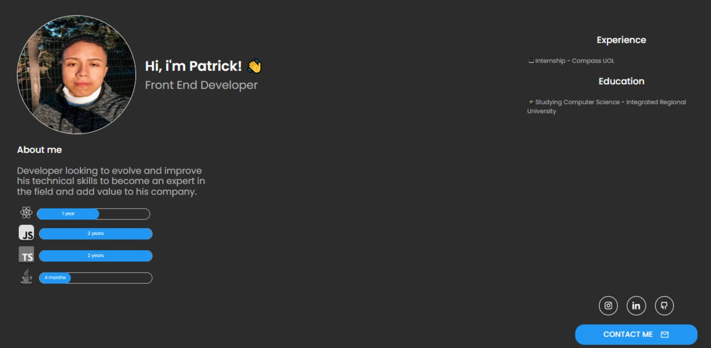

[JAVASCRIPT__BADGE]: https://img.shields.io/badge/Javascript-000?style=for-the-badge&logo=javascript
[TYPESCRIPT__BADGE]: https://img.shields.io/badge/typescript-D4FAFF?style=for-the-badge&logo=typescript
[REACT__BADGE]: https://img.shields.io/badge/React-005CFE?style=for-the-badge&logo=react
[NEXT__BADGE]:https://img.shields.io/badge/next.js-000000?style=for-the-badge&logo=nextdotjs&logoColor=white
[PROJECT__BADGE]: https://img.shields.io/badge/📱Visit_this_project-000?style=for-the-badge&logo=project
[PROJECT__URL]:https://github.com/Patrick-1810/my-portifolio

<h1 align="center" style="font-weight: bold;">My Portifolio 💻</h1>


![react][REACT__BADGE]
![next][NEXT__BADGE]
![typescript][TYPESCRIPT__BADGE]
![javascript][JAVASCRIPT__BADGE]

<p align="center">
 <a href="#about">About</a> • 
 <a href="#started">Getting Started</a> • 
 <a href="#colab">Develop</a> •
 
</p>


<p align="center">
    
</p>

<h2 id="started">📌 About</h2>

This is the project from my personal portfolio

[![project][PROJECT__BADGE]][PROJECT__URL]

<h2 id="started">🚀 Getting started</h2>

First steps to run the project on your machine

<h3>Prerequisites</h3>

Install or have installed the following requirements

- [NodeJS](https://github.com/)
- [Git 2](https://github.com)

<h3>Cloning</h3>

How to clone your project

```bash
git clone your-project-url-in-github
```

<h3>Starting</h3>

How to start your project

```bash
cd my-portifolio
npm run dev
```


<h2 id="colab">🤝 Developer</h2>

<table>
  <tr>
    <td align="center">
      <a href="#">
        <br>
        <sub>
          <b>Patrick Prestes</b>
        </sub>
      </a>
    </td>
<table>

